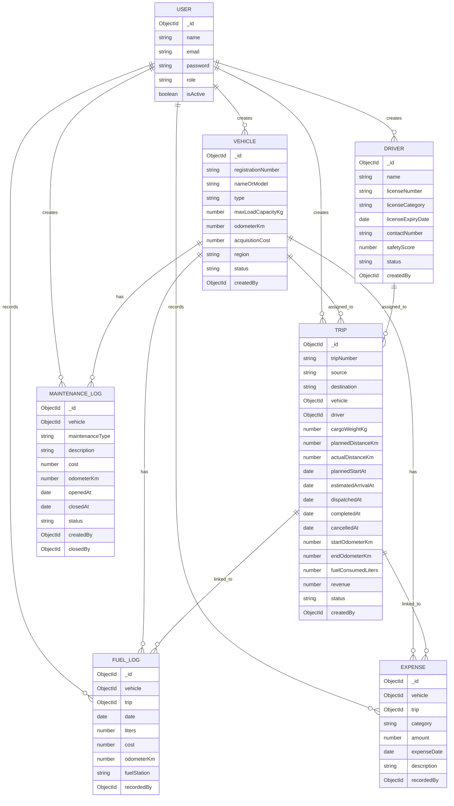

# TransitOps

TransitOps is a full-stack fleet operations management application designed to support the full lifecycle of fleet operations. The project includes a React-based frontend and a Node.js backend, with MongoDB used for persistent storage.

## Repository overview

The repository contains two main modules.

- `backend/`
  - API server implemented using Node.js and Express.
  - User authentication and authorization.
  - Mongoose models for users, vehicles, drivers, trips, maintenance logs, fuel logs, and expenses.
  - Database connection and seed logic.

- `frontend/`
  - React application built with Vite.
  - Authentication pages for login and registration.
  - UI for managing fleet data and viewing operational reports.

## Prerequisites

- Node.js 18 or newer.
- npm 10 or newer.
- MongoDB connection string for a development or demo database.

## Setup

1. Clone the repository.
2. Install backend dependencies:

```bash
cd backend
npm install
```

3. Install frontend dependencies:

```bash
cd ../frontend
npm install
```

4. Create `backend/.env` and define the MongoDB connection string.

Example:

```env
MONGO_URI=mongodb+srv://<username>:<password>@<cluster-url>/<database>?retryWrites=true&w=majority
```

## Database design overview

The current MongoDB schema is centered around fleet operations and uses references between collections. The main entities and relationships are shown below.



## Running the application

### Start the backend

From the `backend` directory:

```bash
npm run dev
```

This command starts the API server and makes the backend available for the frontend.

### Start the frontend

From the `frontend` directory:

```bash
npm run dev
```

The React frontend will run in development mode and connect to the backend API.

## Seed data and demo access

The repository includes a database seeding script to initialize a complete demo environment.

From the `backend` directory, run:

```bash
npm run seed
```

This command resets the database collections and loads a judge-ready dataset, including users, vehicles, drivers, trips, maintenance logs, fuel logs, and expenses.

The application currently maintains only one preset fleet manager account. Random users cannot register as a fleet manager through the public registration flow in the current implementation.

Use the seeded fleet manager account to sign in:

- Email: `manager@transitops.demo`
- Password: `TransitOps@123`

Running `npm run seed` ensures the database is populated and this account is available.

## Notes

- The seed command is the recommended method to initialize the database for local evaluation.
- No backend or frontend source code changes are required to run the project as provided.
